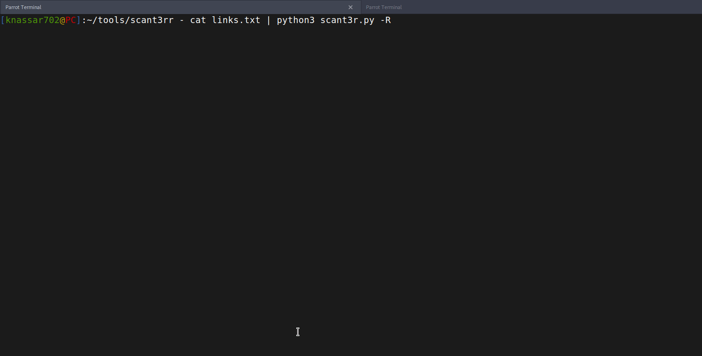
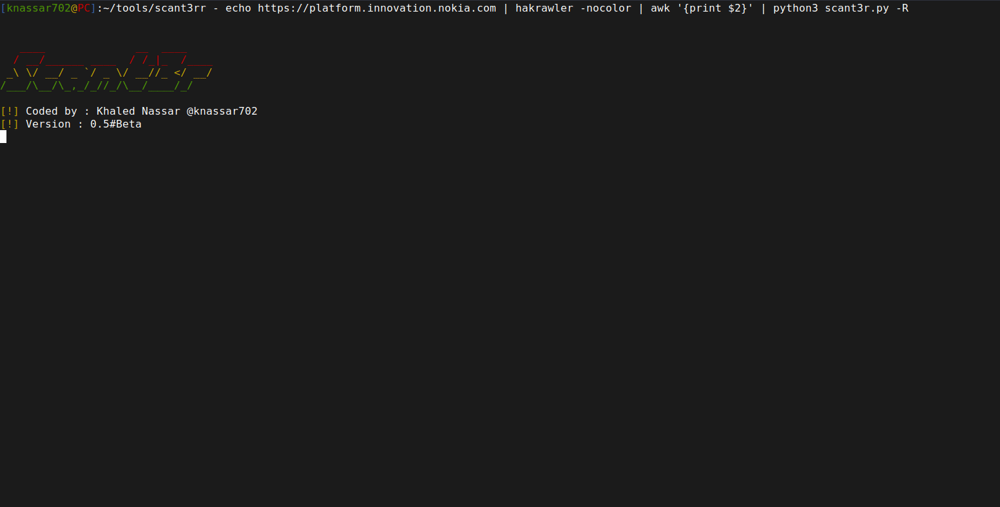
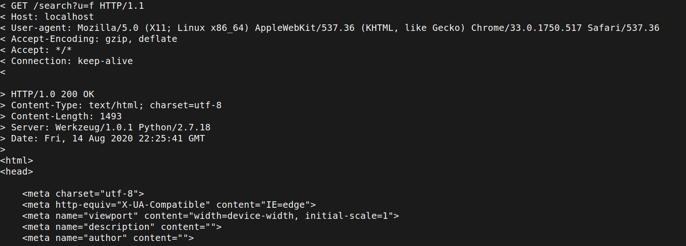

# Scant3r - web application vulnerability scanner

**Why would you use Scant3r?**

Scant3r Scans all URLs with multiple HTTP Methods and Tries to look for bugs with basic exploits as **XSS - SQLI - RCE - SSTI** from Headers and URL Parameters
By chaining [waybackurls](https://github.com/tomnomnom/waybackurls) or [gau](https://github.com/lc/gau) <br>
with Scant3r you will have more time to look into functions and get Easy bugs on the way :)


### What will Scant3r give you?
**Scant3r will give you more time to focus on functionailities We've provided some modules to help you**
| Module              | Description                   |
| :-------------    | :-------------                |
| **PMG** | dump a intersting **parameters** from [waybackurls](https://github.com/tomnomnom/waybackurls)|
| **lorsrf** | Bruteforcing on Hidden parameters to find SSRF vulnerability |
| **headers** | inject **SSTI - XSS - RCE - SQLI** payloads in HTTP Headers |
| **neon** | scans admin panel from CVE-2019-20141 |


***
### Demo 



**Nokia** https://www.nokia.com/responsible-disclosure/


**IBM** https://hackerone.com/ibm


## Installation
### Linux 
```bash
$ git clone https://github.com/knassar702/scant3r
$ cd scant3r
$ pip3 install -r requirements.txt
```
### Docker 
```bash
$ docker build -t scant3r https://github.com/knassar702/scant3r.git
$ docker run -it scant3r -h
```


**Usage**
* normal scan
```bash
$ echo  "http://testphp.vulnweb.com/search.php?test=query&searchFor=1&goButton=go" | python3 scant3r.py 
```
* add module
```bash
$ echo  "http://testphp.vulnweb.com/search.php?test=query&searchFor=1&goButton=go" | python3 scant3r.py -m headers
# note : use -S if you need to use scanner after use modules
```
* random User-agents
```bash
$ echo  "http://testphp.vulnweb.com/search.php?test=query&searchFor=1&goButton=go" | python3 scant3r.py -R
```
* add custom headers
```bash
$ echo  "http://testphp.vulnweb.com/search.php?test=query&searchFor=1&goButton=go" | python3 scant3r.py -H "Auth: U2NhblQzcgo=\nNew: True"
```
* add timeout
```bash
$ echo  "http://testphp.vulnweb.com/search.php?test=query&searchFor=1&goButton=go" | python3 scant3r.py -t 1000
```
* add threads
```bash
$ echo  "http://testphp.vulnweb.com/search.php?test=query&searchFor=1&goButton=go" | python3 scant3r.py -w 50
```
* add http/https proxy
```bash
$ echo  "http://testphp.vulnweb.com/search.php?test=query&searchFor=1&goButton=go" | python3 scant3r.py -p http://localhost:8080
```
* add cookies
```bash
$ echo  "http://testphp.vulnweb.com/search.php?test=query&searchFor=1&goButton=go" | python3 scant3r.py -c 'login=test%2Ftest'
```
* follow redirects
```bash
$ echo  "http://testphp.vulnweb.com/search.php?test=query&searchFor=1&goButton=go" | python3 scant3r.py -r
```
* dump http requests/responses
```bash
$ echo  "http://testphp.vulnweb.com/search.php?test=query&searchFor=1&goButton=go" | python3 scant3r.py -H "Auth: U2NhblQzcgo=" -d
```


* remove logo
```bash
$ echo  "http://testphp.vulnweb.com/search.php?test=query&searchFor=1&goButton=go" | python3 scant3r.py --nologo
```

